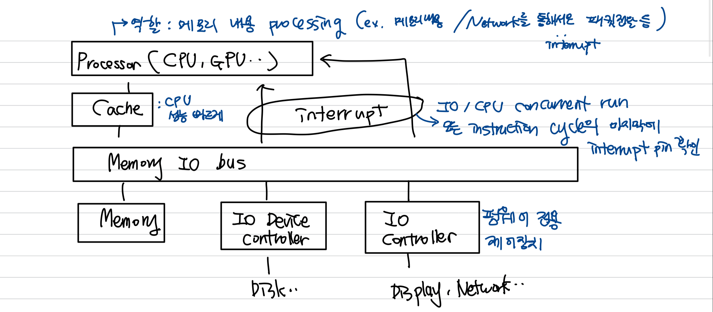
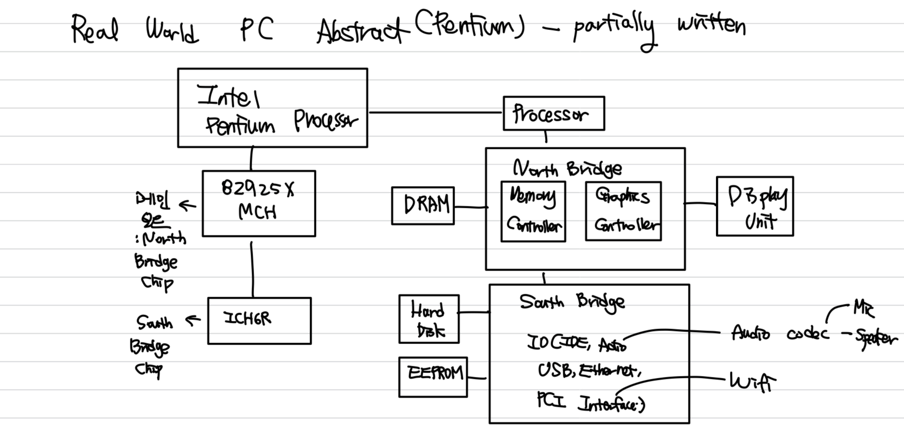
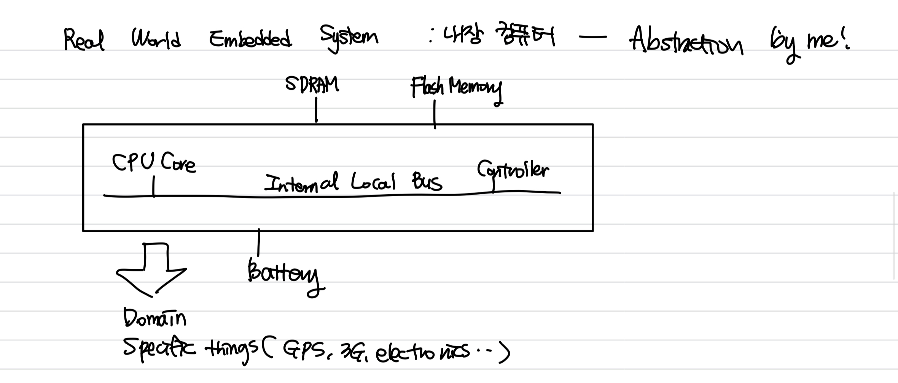

<h1>[2] OS - background</h1>

즉 CPU가 작업을 하다가(main memory code 수행(그 코드가 내 프로그램이든 OS 코드이든)) 어떤 때는 내 코드, 어떤 때는 1000만개도 넘는 시스템 코드(ex. interrupt)가 돌아감
1. Code(Disk)->Ram(Memory)
2. Network통신(Ethernet) controller : IO controller
CPU가 IO controller로부터 정보를 얻는 법
<h1>기본 철학 : Interrupt</h1>
IO Controller : 펌웨어(약간.. CPU 미니 버전같은 느낌)가 돌아가는 전용 제어장치 -> 코드를 내부에 넣고, 그 코드를 넣어버림(embedded system이라고 부르는 이유) 
조그만 컴퓨터가 있는 것과 비슷하게 취급할 수 있음 
** controller는 CPU와 무관하게 스스로 돌아감 -> 펌웨어코드, 컴파일된 특정 코드만 -> active한 주체라고 볼 수 있음(그러나 계속 이것만 돌기에 OS와 다름) 참고로  코드를 만드는 사람은 그 controller를 만든 회사 
ex> Network와 연결된 IO controller : 계속 Network만 함(Ethernet(LAN: 패킷 도착을 모니터링하거나 보낼 패킷이 있는지 체크함), Wifi) 
ex> Display와 연결된 IO controller : 보여주는 역할만 함 
-> 예시상황 : 옆컴퓨터에서 데이터를 보내려고 함. 문제는 패킷이 온 걸 알때, 프로세스를 어떻게 처리할지임. -> controller는 OS에게 이 사실을 알려야하고, "이 패킷 OS 너가 해당 목표 process에 전달해라"라고 하고 싶음 -> <h1 style="color: #ff0000">Interrupt</h1>
-> 모든 IO controller는 CPU interrupt 핀에 연결됨 
Interrupt : CPU의 physical pin에 signal을 줌으로서 controller가 알려주는 것 
CPU는 모든 instruction cycle 끝에 interrupt를 체크한다. 
즉 Interrupt가 active이면 그 순간 CPU는 수행하던 일을 멈추고, IO controller가 요구한 interrupt를 처리한다 
- 패킷(in buffer)을 Main Memory로 OS가 copy
- CPU는 process를 하다가 Interrupt, 즉 OS 모드로 바뀜(유저가 아니라 운영체제 코드로 jump)
- buffer내용을 Ram 어딘가로 Transfer해야 종료 -> Interrupt Handling
- 이 다음에 다시 process로 돌아감

정리하면
CPU는 메인 메모리와 Process사이를 계속해서 돌고, n개의 IO controller는 독립적으로 계속 돌고 있음 
이렇게 본인 일만 하다가 할일이 생기면 Interrupt를 통해 CPU에게 부탁 -> OS는 그 할일을 대행 

