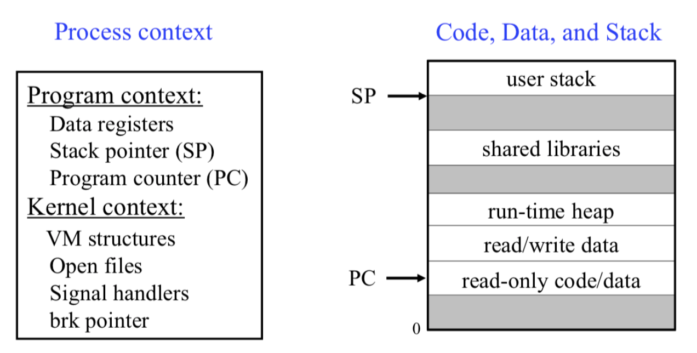
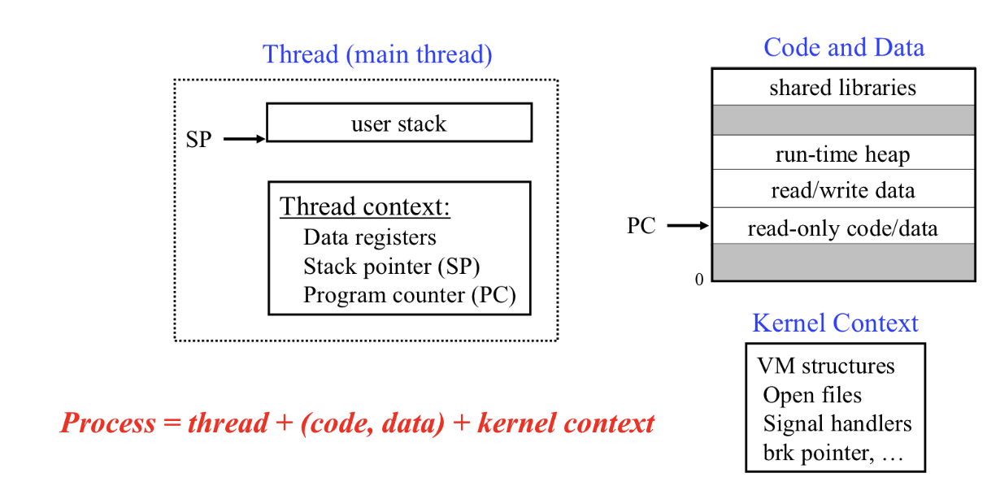
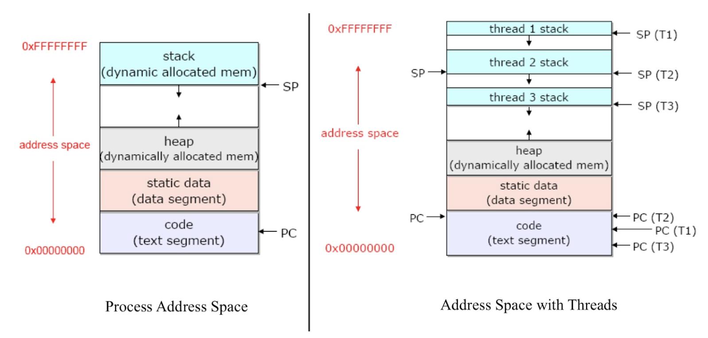
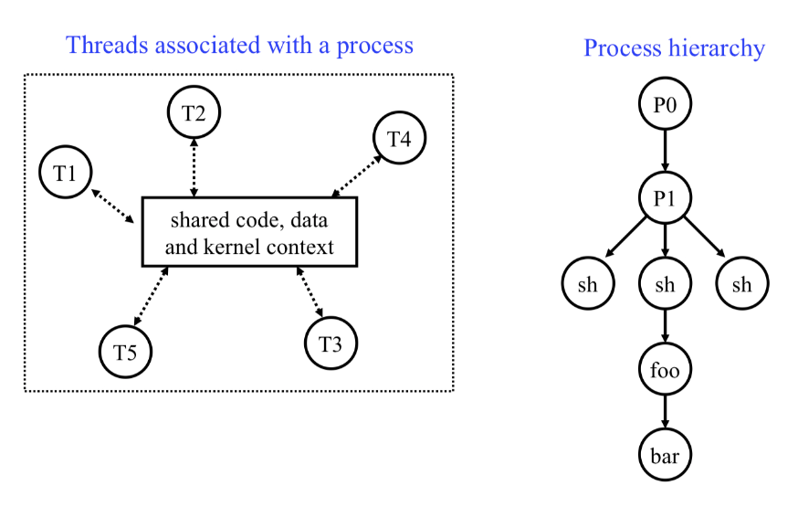
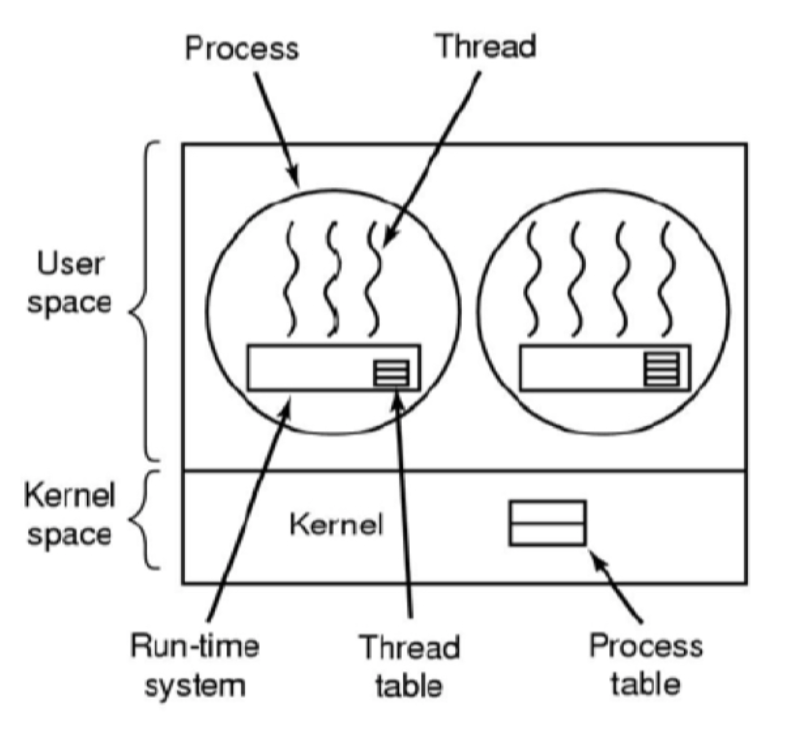

<h1>[4] OS - threads</h1>
<h1>1. Background</h1>
<h1>process 모델의 한계</h1>
- cooperating process: 웹서버가 process fork 너무 많이 하면 자기 자신의 카피를 너무 많이 하게됨. 이렇게 되면, memory 사용부터 여러 비효율적인 문제가 발생하게 된다. 똑같은 걸 1000개씩이나 copy해야하나?
- multiprocessing : 전통적인 processs는 multiprocessor architecture의 장점을 가질 수 없다. 왜냐하면 프로세스는 단 하나의 프로세서만 가능하기 때문이다.
멀티 프로세서여도, 하나의 프로세서가 과연 cpu가 많다고 더 빠른가? 아니다. 왜냐하면 어차피 1개 프로세스는 1개 cpu만 가능하니까..
- 즉, Process가 오버헤드가 너무 많음. 왜냐하면 모든 자료구조가 할당되고 초기화되어야하기 때문. IPC도 OS를 거쳐서 통신하므로 너무 오버헤드가 많음
<h1>2. Thread model</h1>
- thread란? 프로그램 내에서 실행되는 명령어의 sequence. 이는 PC(program counter)와 local variable, return register을 추적하는 stack으로 이루어진다.
- thread는 프로세스 명령어와 대부분의 데이터들을 공유한다. 심지어는 OS의 상태도 공유한다. global, program context까지도 공유할 수 있다.
전통적인 process의 모습

이 중에서 thread가 공유할 수있는 게 뭐가 있을까? 이미지에는 user stack 빼고 가능하다. stack이 불가능한 이유는, 하나하나 현재 상태라서 그렇다. context 중에서는 kernel context를 공유한다.

만약 프로세스가 thread를 여러개 들고 있다면 여러개의 thread는 자신만의 stack, stackpointer, pc, data register, tid를 가지고 나머지는 전부 공유한다.(code, data, kernel context, shared library, heap)
<h1>장점</h1>
1. 공유 가능하다. 
2. 가볍다.  
3. 여러개 CPU로 병렬 효과 
->그런데, 공유하는 데이터를 어떻게 sync?
<h1>[3] Process vs Thread</h1>

address space가 다른 것을 확인할 수 있다.

process hierarchy와 thread도 많이 다르다. tree hierarchy도 일단 없다. 
실제 코드로도 다르다. process : fork/thread: thread_fork이다.  
이제 thread model에서 process는 그저 thread를 실행하는 container이다. 즉, thread는 단일 프로세스에 귀속되며, 프로세스에는 여러개의 thread가 있을 수 있다는 것이다. 
thread, process의 공통점은 scheduled된다는 점과, 논리적인 흐름이 있다는 것이다.  
차이점은 thread는 code, data를 공유하지만 process는 그렇지 않고, thread는 switching, terminating이 덜 비싸다는 점이다. 
<h1>Thread의 장점</h1>
1. concurrency가 저렴하다 
2. 생성, 제거, context switching에 시간이 덜 든다. 
3. communication enhancing 
4. 여러개의 thread를 parallel하게 돌릴 수 있다. 
<h1>Thread의 단점</h1>
1. 메모리 관리가 어렵다. 
2. shared data의 race condition문제 
3. thread몇개 만들지 안정함 
4. 공유된 resource를 처리하는 방법
<h1>4. Thread 구현</h1>
<h1>어디에서 구현을 시작할 것인가?</h1>
1. user-level process: 프로그램에 link된 library가 thread 관리
    - 가능한 이유 : thread가 같은 address space를 공유하기 때문이며, PC, SP, register과 같은 하드웨어만 다르다. 이들은 user-level process에서 변경 가능하다. -> user level library로 가능한 것이다.
    - 커널은 쓰레드의 존재를 눈치채지 못한다.
    - 라이브러리가 생성, 동기화, 스케쥴링, 관리까지 다 한다.

위 그림에서, 커널은 동그라미 부분만 안다. 즉 User-level thread인 원 안의 네모가 마치 조그만 커널같은 느낌이다.  
이들은 Many-to-one, 즉 많은 User-level thread가 single kernel thread(=process)에 map되는 것이다. 이들은 아주 가볍고, 싸고, 빠른 모델이다. 그러나 문제는 IO 등에 의해 thread 1번이 block되면 2, 3번도 block 된다. 커널이 볼 때는 “스레드 A, B, C가 돌아가는 중”이 아니라 “프로세스(또는 하나의 Kernel level thread) 하나가 system call을 수행하다가 블록됐다”로 인식한다. 따라서 시스템 콜이 블록 상태가 되면 그 '프로세스/KLT 전부'가 스케줄링에서 빠지고, 유저 레벨 스레드 A, B, C 중 어느 것도 CPU를 얻을 수 없게 된다. 유저 레벨 스레드는 커널 차원에서 개별적으로 관리되지 않기 때문에, 하나가 블록되면 프로세스 자체가 블록되어 그 안의 모든 유저 레벨 스레드가 함께 멈출 수밖에 없다는 것이 핵심이다. “그냥 다른 스레드로 컨텍스트 스위칭”은 유저 레벨에서 할 수 있으나, 이미 커널에 의해 프로세스가 블록되었으므로 실질적인 스케줄링 자체가 불가능하다.  Multiprocessor에서 performance가 늘지 않는다. 전혀 멀티쓰레드의 이점이 없다. 
2. OS에서 구현해보자. 
Kernel이 process와 thread의 context information에 대한 정보를 가지고 있다. kernel text, global data를 공유하며 Own kernel stack을 가진다. 이들은 독립적으로 scheduled되며, kernel에 의한 동기화가 가능하다. kernel은 thread, process를 각각 인지하며 scheduling 대상이 누구인지가 가장 중요하다. thread 1이 블락되어도 2, 3이 가능하다. 이들은 1-1 모델로, 각 user-level thread가 kernel-level thread로 map된다. 이는 CPU여러개에서 동시 run이 가능하며, blocking issue를 해결한다는 장점을 가진다. 특히나 멀티 프로세스가 아닌 단일 프로세스에서도 block issue는 해결이 된다. 
이를 many-to-many로도 구현할 수 있는데, 여러개의 user level thread를 여러개의 kernel thread와 map할 수 있다. 장점으로는 user space에서의 thread creation, parallel, blocking issue가 없다는 것이 있다. many-many는 마치 1-1같은 느낌이다. 
<h1>Thread 사용법</h1>
Pthread: POSIX API 
thread는 성능, 자원에 대한 고민이 많아짐. 
밑에는 예시 코드이다. 

'''
#include <stdio.h> 
#include <unistd.h> 
#include <stdlib.h> 
#include <pthread.h> 
/* 최대 쓰레드 갯수 */
#define MAX_THREAD_NUM 5
 /* thread main function 선언 */
void *thread_function(void *arg); 
int main() 
{ 
    int res; 
    pthread_t thread_handle[ MAX_THREAD_NUM ]; 
    void *thread_result; 
    int i;
    
    /* MAX_THREAD_NUM 만큼 pthread 를 생성한다. */
    
    for ( i = 0 ; i < MAX_THREAD_NUM ; i++ ) {
        
        /* pthread 를 생성하여 생성된 pthread 에 대한 handle 을 
        tread_handle 배열에 저장한다. 
        pthread 의 main function 은 세번째 인자인 thread_function 이 
        되며, 인자로 몇번째로 생성된 pthread 인지를 나타내는 i 값을 
        넘긴다. 
        */
        
        res = pthread_create( &(thread_handle[i]), 
        NULL, 
        thread_function, 
        (void *)i );
        
        /* 결과값을 확인하여 Error 가 발생하였는지 확인한다. */
        
        if ( res != 0 ) { 
            printf( "[Main] Thread Creation Fail.\n" ); 
            exit(1); 
        } 
    }
    
    /* 메세지 출력 */
    printf( "[Main] Waiting for threads to finish...\n" );
    /* MAX_THREAD_NUM 만큼 생성된 모든 pthread 가 종료되기를 기다린다 */
    for ( i = 0 ; i < MAX_THREAD_NUM ; i++ ) {
        
        /* 생성된 pthread 가 종료되기를 기다린다. 
        * pthread 내부에서 pthread_exit 가 호출되기 전까지 블럭된다. 
        * pthread_exit 의 인자를 thread_result 값으로 전달받는다. 
        */
        
        res = pthread_join( thread_handle[i], &thread_result );
        /* 결과값을 확인하여 pthread 가 올바로 join 되었는지 확인한다. */
        if ( res == 0 ) { 
            printf( "[Main] join thread(%d)\n", i ); 
        } 
        else { 
            printf( "[Main] join thread(%d) failed\n", i ); 
        } 
    } 
     /* 메세지 출력 */
    printf( "[Main] All done\n" ); 
    exit(1); 
}
/* pthread 의 main function */
void *thread_function( void *arg )
{
    /* 인자로 받은 값을 my_number 에 저장한다. */
    int my_number = (int)arg;
    int rand_num;
    /* 몇번째 pthread 가 실행중인지 메세지를 출력한다. */
    printf( "[thread(%d)] is running\n", my_number );
    /* 1 부터 5 사이의 임의의 값을 생성한다. */
    rand_num = 1+(int)(5.0*rand()/(RAND_MAX+1.0));
    /* 생성된 임의의 값만큼 sleep 한다. */
    sleep( rand_num );
    /* sleep 이 끝났음을 메세지로 출력한다. */
    printf( "[thread(%d)] job done\n", my_number );
    /* thread 작업이 종료되었음을 알린다. */
    pthread_exit( NULL );
}
'''

<h1>Linux에서의 Thread구현</h1>
linux는 프로세스, 쓰레드를 구별하지 않는다. 그렇다면 어떻게 구현하는가? Process와 Thread의 철학적인 차이를 구별해보면, 사실은 공유의 유무라고 볼 수 있다. fork랑 비슷한데, 그러면 인자를 넣어서 주는 fork처럼 구현해보면 되지 않을까? 
Linux는 clone syscall을 통해서 thread를 구현한다. fork와 유사하지만 process의 복사본을 생성하지는 않고, address space of parent task(=process)만 공유한다. 다만, clone의 flag들로 parent 가 child와 얼마나 많이 공유하는지를 구별한다. 
Linux의 자료구조인 PCB는 Task Structure로, process, thread를 전부 다 커버하는 내용이다. 되게 흥미로운 구현 방법인데, thread는 자료구조에 손댈 필요가 없어진 것이다..!!
Linux에서의 thread는 프로세스와 같아서, 공유하지 않으면 process, 공유하면 thread가 된다. 
<h1>최근의 Pthread implementation</h1>
1-1: clone() syscall을 사용함.